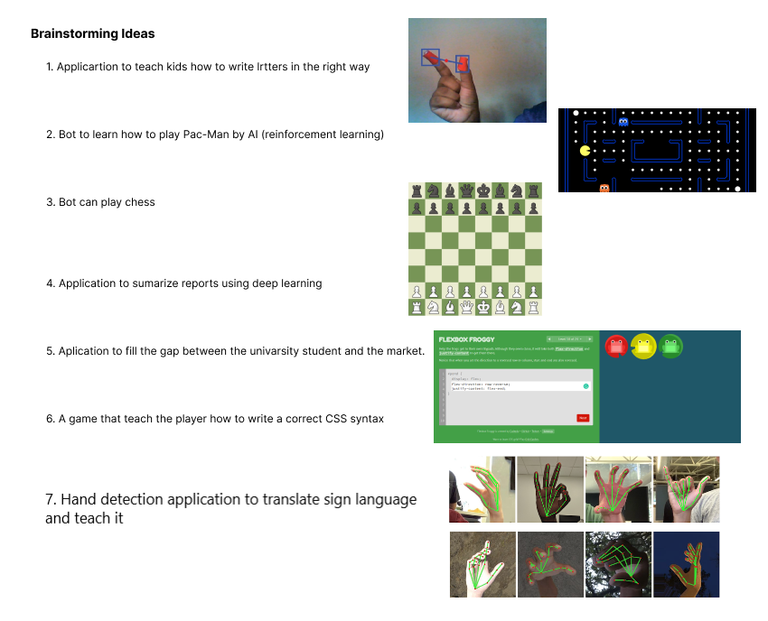

# Brainstorming Ideas

# Ideas Pitch

## main idea 1: Sign language education application with translation feature.

A computet application (GUI) to teach the people with special need how to use sign language and practice it as many times as needed, this application could work as translator also. The detection prossecs done with the help of camera that detects the user's hand gestures using computer vision and artificial intelligence. We can use the following packages:

    OpenCV
    mediapipe
    tkinter
    gTTS

 

### Pain points:
The special needs community is growing due to many factors; they have already exceeded 400 million worldwide. And to help them blend and contribute to their societies, "Sign Language" is their tool for direct communication with others. The dilemma is that only 1% of the world population has acquired the language, and can reach those challenged individuals. So, with tech field advancement there are many attempts to come up with solutions to overcome the communication issue and to help more people learn the language and reach to the special community. The project at hand presents one of those attempts.

 

 

## main idea 2: Future Alphabet (selected)

An application for VR glasses to teach kids how to write letters in the proper format using a virtual mouse (camera that detects the user's hand gestures using computer vision and artificial intelligence), we can use the following libraries:

    OpenCV: for image processing and drawing
    mediapipe: for hand tracking 
    autopy: for controlling the mouse movement and click 

 

### Pain points:
In our project, we want to solve the main problem that
the kids and toddlers face during their first years in the learning journey. which is writing Alphabetical letters. Most of them find it hard to write the letter in the proper form so they tend to draw what they see.
It is proven that writing in the air helps the kid to memorize the letter and the way to write it more efficiently.

### Stretch goals:

- The data is then gathered and analyzed to determine the most common errors made by each user so that the program can pay more attention to it and teach it to that child more intensively. Finally, offer each user data that can be visualized (e.x matplotlib).
- Voice recognition could be added for pronunciation of the - letters (e.x apiai, or google-cloud-speech).
- Provide words that start with each letter as an example.

 

 

## Main idea  3: Pac-Man

Make an AI bot that can learn how to play the game (Pac-Man) using computer vision and reinforcement learning (e.x OpenAI, gym, universe). This bot must reach a new record. To make it more challenging we suggest adding a time limit to the game.
For data analysis, we may compare the number of iterations required by the AI to win the game with the map size and enemy count. We can also see how long it takes the AI to get a new record.
